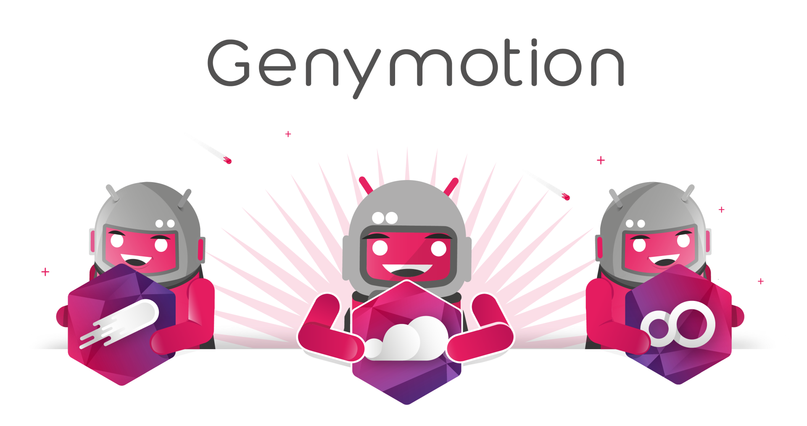

## 👋 Hi there

Our Genyboys and Genygirls look familiar 😊? Yes, we are making the most out of Android since 2011 💪.

Initially a simple, fast, developer’s favorite Android emulator when others would take more than the time for a coffee ☕ to setup and launch a virtual device; Genymotion has evolved into a full-fledged Android platform, available across multiple media both in the cloud and on your desktop.

Our vision ✨ is to provide Android capabilities at an affordable price to all stakeholders who have to navigate the Android world, from the newcomer to the all-around expert.

## ⚙️ Products

| Product | Description |
| :---: |--- |
|   Device Image | Virtual Android images for Cloud providers ([AWS](https://aws.amazon.com/marketplace/seller-profile?id=933724b4-d35f-4266-905e-e52e4792bc45), [GCP](https://console.cloud.google.com/search;q=genymotion), [Azure](https://azuremarketplace.microsoft.com/en-us/marketplace/apps/genymobile.genymotion-cloud), [Alibaba](https://marketplace.alibabacloud.com/products?keywords=genymotion), [Oracle](https://cloudmarketplace.oracle.com/marketplace/en_US/listing/100743872)). |
|   [SaaS](https://cloud.geny.io/) | Genymotion Android virtual devices online on Genymobile servers for test automation and more! |
|   [Desktop](https://www.genymotion.com/download/) | Create and run virtual Android devices with multiple Android versions on your computer. |

[💡 Let us know](https://github.com/Genymobile/feedback/discussions) if you have any suggestions.

Oh by the way, you can find our product documentation 📖 [here](https://docs.genymotion.com/).

## 🤝 Opensource contributing

We maintain our own open source projects:

- [scrcpy](https://github.com/Genymobile/scrcpy) - A tool to display and control your Android device
- [gnirehtet](https://github.com/Genymobile/gnirehtet) - Provide reverse tethering for Android

while contributing to the third-party tools 🔧 we use for our Genymotion products and documentation:

- [Material For Mkdocs](https://github.com/squidfunk/mkdocs-material) - A [Material Design](https://material.io/) theme for [MkDocs](https://www.mkdocs.org/) by [squidfunk](https://github.com/squidfunk)

Genymotion team.

